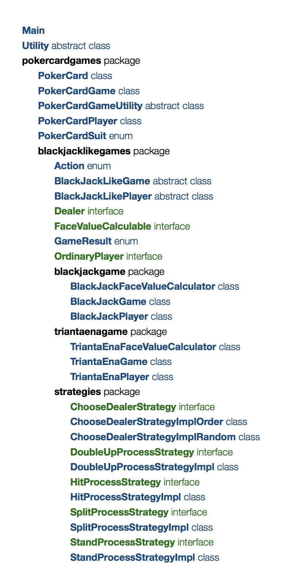

# BLACKJACK DESIGN SPECIFICATIONS

It is not the finalized version, and it's in progress. Please visit later. 

## Team Members

Peng Huang phuang@bu.edu U50250882

Ze Yu zey@bu.edu U32088225

Hong Xin hxin@bu.edu U05528604

## Instructions

Simply compile and run the Main, nothing special to note. 

Welcome to contact [phuang@bu.edu](mailto:phuang@bu.edu) if you encounter any issues with compilation and execution.

## Class Descriptions

In development, the classes are organized as a well-designed structure with packages as follows. 

Main class: The entrance of the program of games. 

Utility class: It contains a few utility fields, such as ANSI colors used in the terminal output, and methods, such as prompting user, getting input integer from the user, and random integer generation.

PokerCard class: A poker card with rank, suit, and orientation. 

PokerCardGame class: A game played with poker cards. 

PokerCardPlayer class: A player playing with poker cards. 

PokerCardGameUtiltiy class: It contains utility methods for poker card games, such as gernerating a standard deck of 52 poker cards in random order. In the future, it could be added more utility methods related with poker cards. 

PokerCardSuit enum: It stands for one of the four suits of poker card, including spades, hearts, clubs, and diamonds.

Action enum: It stands for the action of BlackJack-like game, like Hit, Stand, Split, and Double Up. It's used as a medium for messages delivery between the games and players. 

BlackJackLikeGame class: It contains all the common features and methods shared by BlackJack game and Trianta Ena game, such as dealer, players, start, printing table, getting game result and so on. 

BlackJackLikePlayer class: It contains all the common features and methods shared by BlackJack game player and Trianta Ena game player, such as receiving a poker card, print all the cards in hand. What's more, it could act as two roles, Dealer, and Ordinary Player, by implementing the Dealer interface and OrdinaryPlayer interface. 

Dealer interface: A role of BlackJack-like player's. It can prepare a deck of poker cards and deal a poker card.

FaceValueCalculable interface: It should be implemented by face value calculators of various BlackJack-like games. It provides uniform motheds protocol, like calculating the total face value of a hand of poker cards, and judging whether the combination of a hand of poker cards is natural. 

#to be continued

