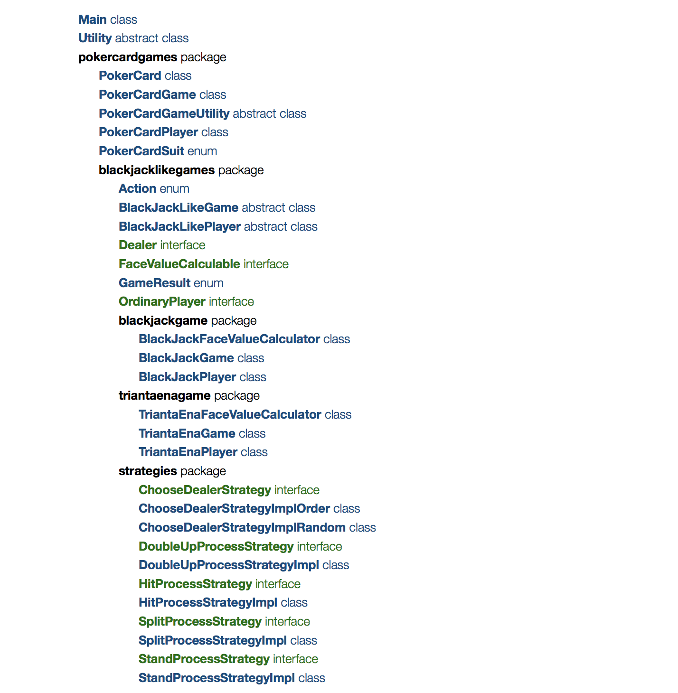
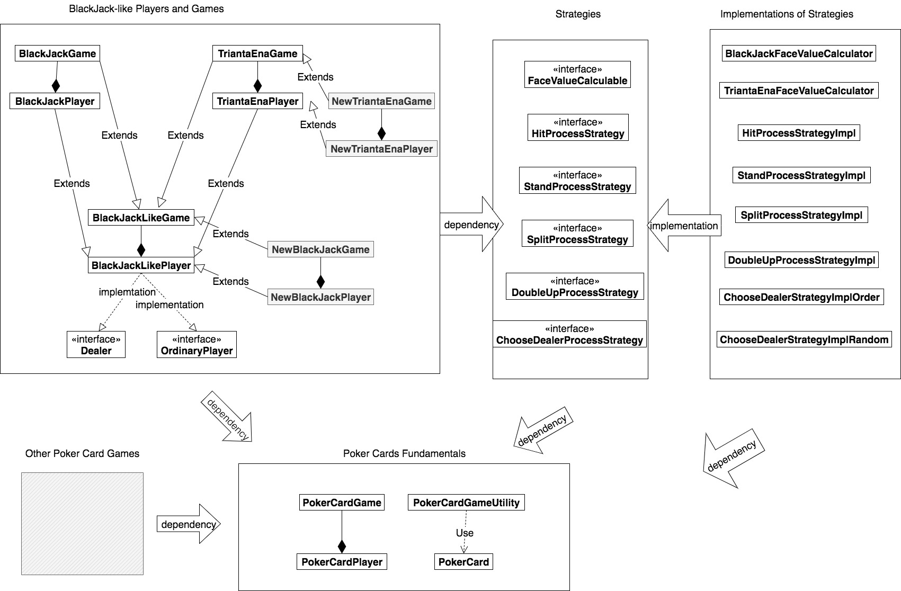

# BLACKJACK DESIGN SPECIFICATIONS

## Team Members

Peng Huang phuang@bu.edu U50250882

Ze Yu zey@bu.edu U32088225

Hong Xin hxin@bu.edu U05528604


## Instructions

Simply compile and run the Main.main(), nothing special to note. 

Welcome to contact [phuang@bu.edu](mailto:phuang@bu.edu) if you encounter any issues with compilation and execution.


## Class Descriptions

In development, the classes are organized as a well-designed structure with packages as follows.

The Package Structure



The UML Diagram



##### Main class

The entrance of the program of games. 

##### Utility class

It contains a few utility fields, such as ANSI colors used in the terminal output, and methods, such as prompting user, getting input integer from the user, and random integer generation.

##### PokerCard class

A poker card with rank, suit, and orientation. 

##### PokerCardGame class

A game played with poker cards. 

##### PokerCardPlayer class

A player playing with poker cards. 

##### PokerCardGameUtiltiy class

It contains utility methods for poker card games, such as generating a standard deck of 52 poker cards in random order. In the future, it could be added more utility methods related to poker cards. 

##### PokerCardSuit enum

It stands for one of the four suits of poker cards, including spades, hearts, clubs, and diamonds.

##### Action enum

It stands for the action of BlackJack-like game, like Hit, Stand, Split, and Double Up. It's used as a medium for messages delivery between the games and players. 

##### BlackJackLikeGame class

It contains all the common features and methods shared by BlackJack game and Trianta Ena game, such as dealer, players, start, printing table, getting the game result and so on. 

##### BlackJackLikePlayer class

It contains all the common features and methods shared by BlackJack game players and Trianta Ena game players, such as receiving a poker card, print all the cards in hand. What's more, it could act as two roles, Dealer, and Ordinary Player, by implementing the Dealer interface and OrdinaryPlayer interface. 

##### Dealer interface

A role of BlackJack-like players. It can prepare a deck of poker cards and deal a poker card.

##### FaceValueCalculable interface

It should be implemented by face value calculators of various BlackJack-like games. It provides uniform methods protocol, like calculating the total face value of a hand of poker cards, and judging whether the combination of a hand of poker cards is natural. 

##### GameResult enum

3 game results: Win, Lose, and Draw. 

##### OrdinaryPlayer interface

A kind of role of BlackJack-like player. It contains basic capabilities of playing a BlackJack-like game, like receiving a poker card, betting, and so on. 

##### BlackJackFaceValueCalculator class

 It implements the FaceValueCalculable interface, providing a specific algorithm calculation based on the rules of BlackJack game, like  calculating the total face value of a hand of poker cards, and judging whether the combination of a hand of poker cards is natural.

##### BlackJackGame class

It's a BlackJack game, inheriting methods and fields from BlackJackLikeGame. It has exclusive methods like processing split action and double-up action. 

##### BlackJackPlayer class

 It's a player for BlackJack game, inheriting from BlackJackLikePlayer. 

##### TriantaEnaFaceValueCalculator class

 It implements the FaceValueCalculable interface, providing a specific calculation algorithm based on the rules of Trianta Ena game, like  calculating the total face value of a hand of poker cards, and judging whether the combination of a hand of poker cards is natural.

##### TriantaEnaGame class

It's a Trianta Ena game, inheriting methods and fields from BlackJackLikeGame. It has exclusive methods like processing split action and double-up action. 

##### TriantaEnaPlayer class

It's a player for TriantaEna game, inheriting from BlackJackLikePlayer. 

##### ChooseDealerStrategy interface

A method protocol for the strategy of choosing a dealer. 

##### ChooseDealerStrategyImplOrder class

A specific implementation of ChooseDealerStrategy interface, based on sorted order of players. It's used in TriantaEnaGame. 

##### ChooseDealerStategyImplRandom class

A specific implementation of ChooseDealerStrategy interface, based on random. It's used by BlackJackGame. 

##### HitProcessStrategy interface

 A method protocol for the strategy of processing the hit action. 

##### HitProcessStrategyImpl class

A specific implementation of HitProcessStrategy interface, it's used by both BlackJackGame and TriantaEnaGame. 

##### StandProcessStrategy interface

A method protocol for the strategy of processing the stand action. 

##### StandProcessStrategyImpl class

A specific implementation of StandProcessStrategy interface, it's used by both BlackJackGame and TriantaEnaGame. 

##### DoubleUpProcessStrategy interface

 A method protocol for the strategy of double-up action. 

##### DoubleUpProcessStrategyImpl class

A specific implementation of DoubleUpProcessStrategy interface, it's used by BlackJackGame.

##### SplitProcessStrategy interface

 A method protocol for the strategy of split action. 

##### SplitProcessStrategyImpl class

A specific implementation of SplitProcessStrategy interface, it's used by BlackJackGame.


## Highlights

### Scalability

The games can be easily scaled to multiple players, multiple decks of poker cards, multiple hands of poker cards and so on, because these entries are stored in the List data type, by which we mean their numbers are not fixed, for example, you can play the our BlackJack with more than 2 live players. 

### Extensibility by Strategy Pattern 

We use strategy pattern in this project appropriately to achieve its extensibility. As seen in the UML Diagram, the games and their rules (rules of how to calculate the total face values, rules of various actions) are separate, and they are connected by interfaces, i.e. the strategies. There are many advantages to use strategy pattern. 

The game classes don't depend on the details of game rules, they depend on protocols of game rules instead, and the details of rules  also depend on (realize) the protocols of rules, that is to say, we observed the **Dependency Inversion Principle**. It guarantees the stability of high-level modules (game classes) and reusability of low-level modules (rules). 

If the rules need to be modified, we can use new implementation of rules to substitute the original implementation, avoiding direct modification of game classes, which is the **Closed for Modification Principle**. 

We also achieved the **Open for Extension Principle**. If we need to add new variants of games, like shown in the UML diagram, the NewTriantaEnaGame and NewBlackJackGame, the new classes inherit the current classes based on similarity. For example, the NewTriantaEnaGame is inherited from TriantaEnaGame due to high similarity, and the NewBlackJackGame is inherited from BlackJackLikeGame due to low similarity to BlackJackGame. What's more, the new classes are easily able to reuse the current strategies of game rules and face value calculation algorithms, OR use their new created implementations. Different combinations of implementation of strategies greatly enriched the possibility of variants of the games. 

Last but not least, with **Strategy Pattern**, hereafter, the game can be easily extended such that its rules even can be easily customized in the form of free combination by users in runtime!  For example, the users will be able to choose to play with BlackJack-style total face values calculation combined with TriantaEna-style determination of the next dealer in runtime. 

### Low Coupling with Message Pattern

As seen in the UML diagram, there isn't any loop dependency at all. However, it wasn't as this in the beginning. When we were designing the player class and the game class, the game class hold a reference of player class as a member variable, and at the same time, the player class invoked the methods of game class when the player was performing an action. This design formed high coupling between player and game with loop dependency, and we're prone to do like this. 

We introduced Message Pattern to decouple and eliminate the loop dependency. We created the Action class to serve as the medium to deliver messages of actions (hit, stand, etc) from the player to the game. After receiving the message, the game responds to the action using the corresponding strategies. Thus, we decoupled greatly for these two closely related classes, and achieved a low level of coupling in the whole project. 

### Interface Segregation Principle

We observed the Interface Segregation Principle. For instance, a player can play two roles, dealer and ordinary player, in a game, but the player can only play either of them at a time. We abstracted the two roles as two interfaces, Dealer interface, and OrdinaryPlayer interface, both implemented by BlackJackLikePlayer class. Therefore, the game class only needs to focus on the methods of the current role of the players and doesn't need to pay attention to the methods it won't use, like the dealAPokerCard() method when the player is an ordinary player. 

### Singleton Pattern

As the game classes need to be created only once, so we appropriately applied Singleton Pattern  to the game classes. 

```java
public class BlackJackGame extends BlackJackLikeGame {
    /**
     * Singleton Pattern
     */
    private BlackJackGame() {
    }
    private static BlackJackGame instance = null;
    public static BlackJackGame getInstance() {
        if(instance==null) instance=new BlackJackGame();
        return instance;
    }
}
```

### Table-Driven 

We used Table-Driven in the face value conversion and getting the printable rank of a poker card. It's extremely convenient, avoiding using tedious if-statements.

Concise illustration of how we used Table-Driven is following. 

```java
int[] FACE_VALUES ={Integer.MIN_VALUE,1,2,3,4,5,6,7,8,9,10,10,10,10};
String[] RANKS_PRINTED={"ERROR!","A","2","3","4","5","6","7","8","9","10","J","Q","K"};

int rankCode=11;//1 for A, 11 for J, 12 for Q, 13 for K, 2 to 10 for 2 to 10

faceValue=FACE_VALUES[rankCode];
rankPrinted=RANKS_PRINTED[rankCode];

```


### Colorful Interaction

For users' better visual experience, we used colors in the terminal output to distinguish different content. 


